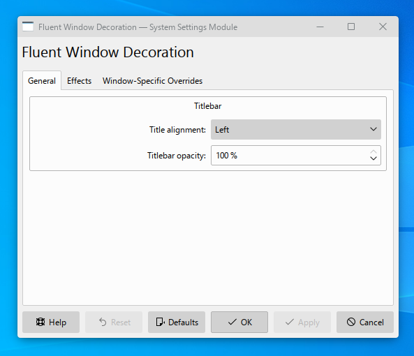

# Fluent

**Fluent** is a fork of Breeze widget style and decoration. Aimed to follow the latest Fluent Design specifications.

**CAUTION:** It's still in a very early stage.

To get rounded corners on all corners, use the [KDE-Rounded-Corners](https://github.com/n4n0GH/KDE-Rounded-Corners) KWin script. I'm planning to include it into the project later.

## Screenshots

Current state:




## How to compile

The project uses the standard CMake buildsystem.

So for example, the whole compilation process could look like this:

```
mkdir build
cd build
cmake -DCMAKE_INSTALL_PREFIX:PATH=/usr ..
make
make install
```
