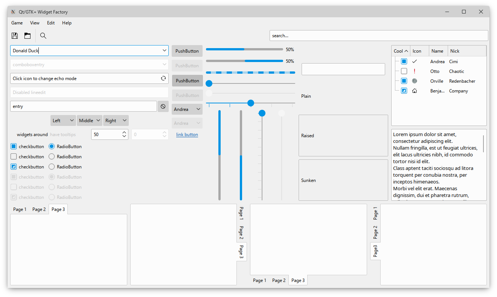

# Fluent

**Fluent** is a fork of Breeze widget style and decoration. Aimed to follow the latest Fluent Design specifications.

**CAUTION:** It's still in a very early stage.

## Screenshots

Current state:



## How to compile

The project uses the standard CMake buildsystem.

So for example, the whole compilation process could look like this:

```
mkdir build
cd build
cmake -DCMAKE_INSTALL_PREFIX:PATH=/usr ..
make
make install
```